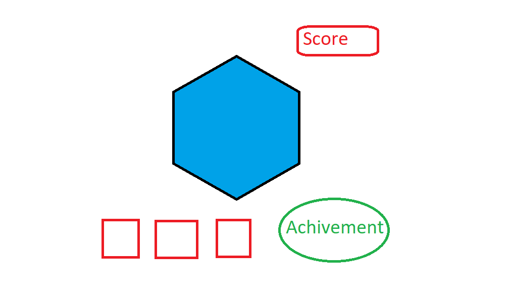

Clicker-Game  
By Brady, Gabby, Maple  

https://bradyleg.github.io/clicker-game/

Concept
  

Score goes up by how many time you've clicked. Get upgrades to increase your score. Upgrades only work once with no cost.

    Clicking: Click the red square to increase the score!
    Upgrades: Purchase an upgrade by clicking anywhere in the box of the specific upgrade, and a notification will pop up informing successful purchase
    Achievements: Two achievements, triggered at score 10 and 100 respectively, notify through pop up via unlock, and are added to the achievement list on the side.
